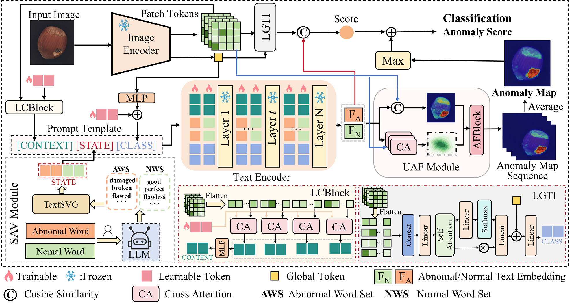

# CMGL（under review）

## Introduction

This repository provides the related code and  experimental details for our research on CMGL



## Implementation

**Environment installation**

```shell
conda create -n CMGL python==3.8
conda activate CMGL
pip install -r requirements.txt
```

**Data preparation**

+ Download MVTec AD dataset form [here](https://www.mvtec.com/company/research/datasets/mvtec-ad/downloads)
+ Download VisA dataset form [here](https://github.com/amazon-science/spot-diff)
+ Download BTAD dataset form [here](http://avires.dimi.uniud.it/papers/btad/btad.zip)
+ Download KSDD2 dataset form [here](https://www.vicos.si/resources/kolektorsdd/)
+ Download RSDD dataset form [here](https://drive.google.com/file/d/19Qfd732aIud_NtUie87tIPGvOuhsYmJ5/view?usp=sharing)
+ Download DAGM, dataset form [here](https://www.kaggle.com/datasets/mhskjelvareid/dagm-2007-competition-dataset-optical-inspection)
+ Download DTD-Synthetic dataset form [here](https://drive.google.com/drive/folders/10OyPzvI3H6llCZBxKxFlKWt1Pw1tkMK1)
+ The weld anomaly samples are sourced from corporate collaborations. If you want to the data，please send  the email to us. We will send the download link once we receive and confirm your signed agreement. 
+ Before run the model , each dataset is required to be processed into the following format:

    ```
    ./datasets/mvisa/data
    ├── visa
        ├── candle
            ├── train
                ├── good
                    ├── visa_0000_000502.bmp
            ├── test
                ├── good
                    ├── visa_0011_000934.bmp
                ├── anomaly
                    ├── visa_000_001000.bmp
            ├── ground_truth
                ├── anomaly1
                    ├── visa_000_001000.png
    ├── mvtec
        ├── bottle
            ├── train
                ├── good
                    ├── mvtec_000000.bmp
            ├── test
                ├── good
                    ├── mvtec_good_000272.bmp
                ├── anomaly
                    ├── mvtec_broken_large_000209.bmp
            ├── ground_truth
                ├── anomaly
                    ├── mvtec_broken_large_000209.png
    
    ├── meta_mvtec.json
    ├── meta_visa.json
    ```

The related data processing scripts are located in the **./dataset** directory.

**Pretrained weights**

+  The  pretrained weights of CLIP  can be downloaded  form here [[ViT-L-14-336](https://openaipublic.azureedge.net/clip/models/3035c92b350959924f9f00213499208652fc7ea050643e8b385c2dac08641f02/ViT-L-14-336px.pt)(default), [ViT-B-16-224](https://openaipublic.azureedge.net/clip/models/5806e77cd80f8b59890b7e101eabd078d9fb84e6937f9e85e4ecb61988df416f/ViT-B-16.pt), [ViT-L-14-224](https://openaipublic.azureedge.net/clip/models/b8cca3fd41ae0c99ba7e8951adf17d267cdb84cd88be6f7c2e0eca1737a03836/ViT-L-14.pt)].

**Training model**

*  Run the script

    ```shell
    bash train.sh
    ```

**Testing model**

* Run the script
    ```shell
    bash test.sh
    ```

## Notes

+ If there are any issues with the code, please  send the email  to us.
